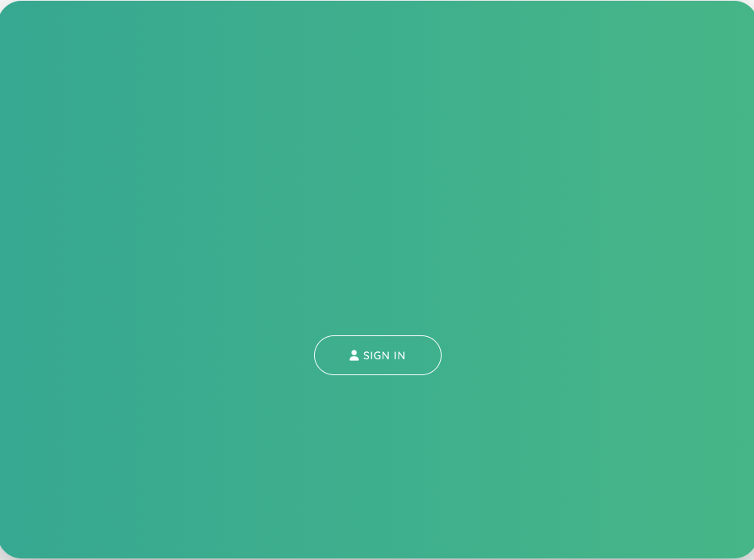
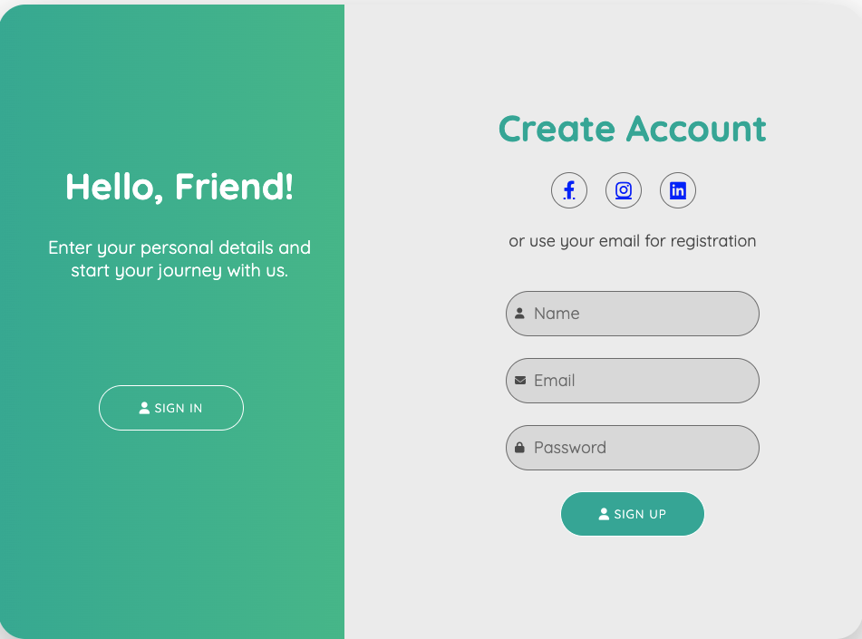

# Sign Up Form Project

## 1. Project Description: 

Initially, the form will only display the sign in 
section. Once the user clicks the sign in button, the create section will appear. This effect is 
created using CSS / Javascript transitions. 

The Form allows a user to:

1. Register to access an application
2. Log into an application using either social media account(s) or username / email / password.

## 2. Tech Stack

1. HTML
2. CSS
3. Javascript

## 3. Installing:

1. Clone the repo

```
https://github.com/AAdewunmi/Project_SignUpForm.git
```

2. Open Project Folder

3. Explore

4. Open index.html in Visual Studio Code, using Live Server

Enjoy :)

## 4. Screenshots





### Adapted From:

Project Name: 
Sign Up Form Project

Authors:

50+ Web Projects with HTML, CSS, and JavaScript
HTML, CSS, and JavaScript. Build 50+ Web Projects with HTML, CSS, and JavaScript

Created by Code And Create, George Lomidze, Lasha Nozadze

Last updated 05/2022

UDEMY URL:
https://www.udemy.com/course/50-web-projects-with-html-css-and-javascript/
